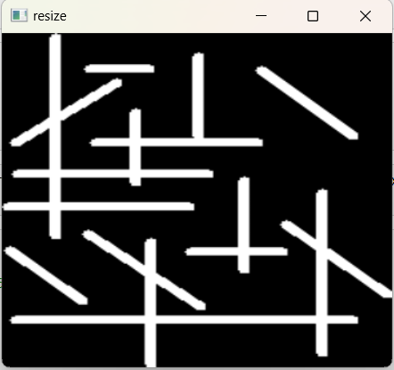
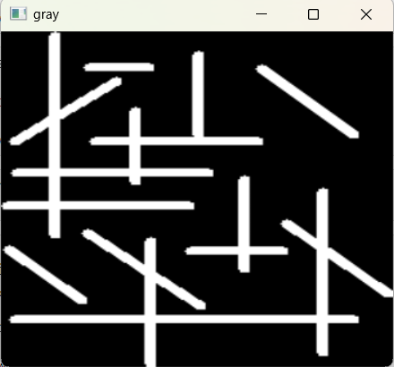

# Edge-Linking-using-Hough-Transform
## Aim:
To write a Python program to detect the lines using Hough Transform.

## Software Required:
Anaconda - Python 3.7

## Algorithm:
### Step1:
Read the image

### Step2:
Convert the input image to gray to get more details

### Step3:
Apply any smoothing filter , here we apply gaussian blur

### Step4:
Apply can edge detector

### Step5:
Apply hough transform and show the detected edge on the original image


## Program:
~~~
NAME : ANISH MJ
REG N0 : 212221230005
~~~
```Python

# Read image and convert it to grayscale image
import cv2
import numpy as np
import matplotlib.pyplot as plt
img = cv2.imread("lined.png")
cv2.imshow("original",img)
cv2.waitKey(0)
cv2.destroyAllWindows()
gray = cv2.cvtColor(bigger, cv2.COLOR_BGR2GRAY)
cv2.imshow("gray",gray)
cv2.waitKey(0)
cv2.destroyAllWindows()

# Find the edges in the image using canny detector and display
canny_edges = cv2.Canny(bigger,10,150)
plt.figure(1)
cv2.imshow("Canny Edges",canny_edges)
cv2.waitKey(0)
cv2.destroyAllWindows


# Detect points that form a line using HoughLinesP
lines = cv2.HoughLinesP(canny_edges,1,np.pi/180,threshold = 80,minLineLength = 50,maxLineGap=250)


# Draw lines on the image
for line in lines:
    x1,y1,x2,y2 = line[0]
    cv2.line(bigger,(x1,y1),(x2,y2),(255,0,0),3)


# Display the result
cv2.imshow("lines",bigger)
cv2.waitKey(0)
cv2.destroyAllWindows()

```
## Output

### Input image and grayscale image


### Canny Edge detector output


### Display the result of Hough transform


## Result:
Thus the program is written with python and OpenCV to detect lines using Hough transform. 
